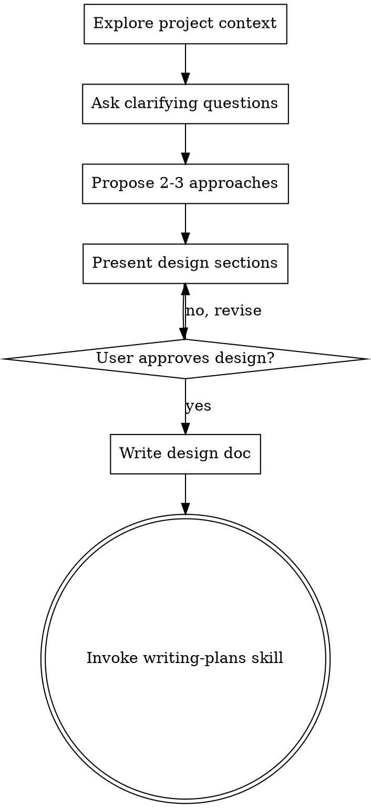

# 将想法头脑风暴成设计方案

## 概述

通过自然的协作对话，帮助将想法转化为完整的设计和规格说明。

首先理解当前项目的上下文，然后逐一提问来完善想法。一旦理解了要构建的内容，就呈现设计方案并获得用户批准。

<HARD-GATE>
在呈现设计方案并获得用户批准之前，不得调用任何实现技能、编写任何代码、搭建任何项目或采取任何实施行动。这适用于每一个项目，无论其看起来多么简单。
</HARD-GATE>

## 反模式："这太简单了，不需要设计"

每个项目都要经历这个过程。待办事项列表、单功能工具、配置更改——所有这些都需要。"简单"的项目正是那些因假设未经审视而造成最多浪费工作的地方。设计可以很简短（真正简单的项目几句话即可），但你必须呈现它并获得批准。

## 检查清单

你必须为以下每个项目创建任务并按顺序完成：

1. **探索项目上下文** — 检查文件、文档、最近的提交
2. **提出澄清问题** — 逐一提问，理解目的/约束/成功标准
3. **提出 2-3 种方案** — 附带权衡分析和你的建议
4. **呈现设计方案** — 根据复杂程度分节呈现，每节后获得用户批准
5. **编写设计文档** — 保存到 `docs/plans/YYYY-MM-DD-<topic>-design.md` 并提交
6. **过渡到实现** — 调用 writing-plans 技能创建实现计划

## 流程图

**终止状态是调用 writing-plans。** 不要调用 frontend-design、mcp-builder 或任何其他实现技能。brainstorming 之后你唯一能调用的技能就是 writing-plans。

## 流程说明

**理解想法：**
- 首先检查当前项目状态（文件、文档、最近的提交）
- 逐一提问来完善想法
- 尽可能使用选择题，但开放式问题也可以
- 每条消息只能问一个问题——如果一个话题需要更多探索，将其拆分为多个问题
- 重点理解：目的、约束、成功标准

**探索方案：**
- 提出 2-3 种不同的方案，附带权衡分析
- 以对话方式呈现选项，给出你的建议和理由
- 以你推荐的选项开头并解释原因

**呈现设计方案：**
- 一旦确信理解了要构建的内容，就呈现设计方案
- 根据复杂程度调整每节的长度：简单的几句话，复杂的 200-300 字
- 每节之后询问是否看起来正确
- 涵盖：架构、组件、数据流、错误处理、测试
- 如果有不合理的地方，准备好返回去澄清

## 设计完成之后

**文档：**
- 将验证过的设计写入 `docs/plans/YYYY-MM-DD-<topic>-design.md`
- 如有可用的 elements-of-style:writing-clearly-and-concisely 技能，可以使用
- 将设计文档提交到 git

**实现：**
- 调用 writing-plans 技能创建详细的实现计划
- 不要调用任何其他技能。下一步是 writing-plans。

## 核心原则

- **一次只问一个问题** — 不要用多个问题压垮用户
- **优先使用选择题** — 在可能的情况下，比开放式问题更容易回答
- **严格执行 YAGNI** — 从所有设计中移除不必要的功能
- **探索替代方案** — 在确定之前总是提出 2-3 种方案
- **增量验证** — 呈现设计，在继续之前获得批准
- **保持灵活** — 当某些地方不合理时，返回去澄清
