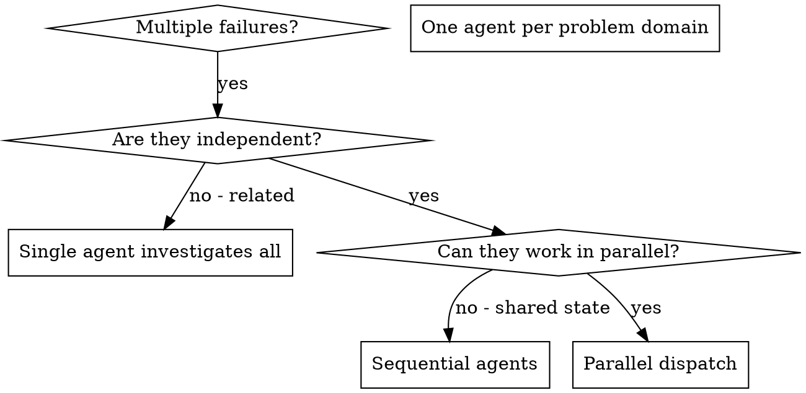

# 并行调度智能体 (Dispatching Parallel Agents)

## 概述

当你有多个不相关的失败（不同的测试文件、不同的子系统、不同的bug）时，按顺序调查它们会浪费时间。每个调查都是独立的，可以并行进行。

**核心原则：** 为每个独立的问题域调度一个智能体。让它们并发工作。

## 何时使用



**使用场景：**
- 3个以上的测试文件失败，且根本原因不同
- 多个子系统独立损坏
- 每个问题可以在无需其他问题上下文的情况下理解
- 调查之间没有共享状态

**不要使用：**
- 失败是相关的（修复一个可能会修复其他）
- 需要理解完整的系统状态
- 智能体会相互干扰

## 模式

### 1. 识别独立域

按损坏的内容对失败进行分组：
- 文件A测试：工具审批流程
- 文件B测试：批处理完成行为
- 文件C测试：中止功能

每个域都是独立的——修复工具审批不会影响中止测试。

### 2. 创建聚焦的智能体任务

每个智能体获得：
- **具体范围：** 一个测试文件或子系统
- **明确目标：** 让这些测试通过
- **约束条件：** 不要更改其他代码
- **预期输出：** 你发现和修复的内容摘要

### 3. 并行调度

```typescript
// 在 Claude Code / AI 环境中
Task("Fix agent-tool-abort.test.ts failures")
Task("Fix batch-completion-behavior.test.ts failures")
Task("Fix tool-approval-race-conditions.test.ts failures")
// 三个任务并发运行
```

### 4. 审查和集成

当智能体返回时：
- 阅读每个摘要
- 验证修复不会冲突
- 运行完整的测试套件
- 集成所有更改

## 智能体提示结构

好的智能体提示是：
1. **聚焦的** - 一个清晰的问题域
2. **自包含的** - 理解问题所需的所有上下文
3. **明确的输出** - 智能体应该返回什么？

```markdown
修复 src/agents/agent-tool-abort.test.ts 中的3个失败测试：

1. "should abort tool with partial output capture" - 期望消息中包含 'interrupted at'
2. "should handle mixed completed and aborted tools" - 快速工具被中止而非完成
3. "should properly track pendingToolCount" - 期望3个结果但得到0个

这些是时序/竞态条件问题。你的任务：

1. 阅读测试文件并理解每个测试验证的内容
2. 识别根本原因 - 是时序问题还是实际bug？
3. 通过以下方式修复：
   - 用基于事件的等待替换任意超时
   - 如果发现中止实现的bug，进行修复
   - 如果测试的是已更改的行为，调整测试期望

不要只是增加超时时间 - 找到真正的问题。

返回：你发现和修复内容的摘要。
```

## 常见错误

**❌ 范围太广：** "修复所有测试" - 智能体会迷失方向
**✅ 具体：** "修复 agent-tool-abort.test.ts" - 聚焦的范围

**❌ 没有上下文：** "修复竞态条件" - 智能体不知道在哪里
**✅ 有上下文：** 粘贴错误消息和测试名称

**❌ 没有约束：** 智能体可能会重构所有内容
**✅ 有约束：** "不要更改生产代码" 或 "仅修复测试"

**❌ 模糊的输出：** "修复它" - 你不知道更改了什么
**✅ 具体的：** "返回根本原因和更改的摘要"

## 何时不使用

**相关失败：** 修复一个可能会修复其他 - 先一起调查
**需要完整上下文：** 理解需要看到整个系统
**探索性调试：** 你还不知道哪里坏了
**共享状态：** 智能体会相互干扰（编辑相同文件、使用相同资源）

## 会话中的真实示例

**场景：** 重大重构后3个文件中的6个测试失败

**失败：**
- agent-tool-abort.test.ts：3个失败（时序问题）
- batch-completion-behavior.test.ts：2个失败（工具未执行）
- tool-approval-race-conditions.test.ts：1个失败（执行计数 = 0）

**决策：** 独立域 - 中止逻辑与批处理完成与竞态条件是分开的

**调度：**
```
智能体 1 → 修复 agent-tool-abort.test.ts
智能体 2 → 修复 batch-completion-behavior.test.ts
智能体 3 → 修复 tool-approval-race-conditions.test.ts
```

**结果：**
- 智能体1：用基于事件的等待替换了超时
- 智能体2：修复了事件结构bug（threadId 位置错误）
- 智能体3：添加了等待异步工具执行完成的逻辑

**集成：** 所有修复都是独立的，没有冲突，完整套件通过

**节省时间：** 3个问题并行解决 vs 顺序解决

## 关键优势

1. **并行化** - 多个调查同时进行
2. **聚焦** - 每个智能体范围狭窄，需要跟踪的上下文更少
3. **独立性** - 智能体不会相互干扰
4. **速度** - 3个问题在1个问题的时间内解决

## 验证

智能体返回后：
1. **审查每个摘要** - 理解更改了什么
2. **检查冲突** - 智能体是否编辑了相同的代码？
3. **运行完整套件** - 验证所有修复一起工作
4. **抽查** - 智能体可能犯系统性错误

## 实际影响

来自调试会话（2025-10-03）：
- 3个文件中的6个失败
- 3个智能体并行调度
- 所有调查并发完成
- 所有修复成功集成
- 智能体更改之间零冲突
