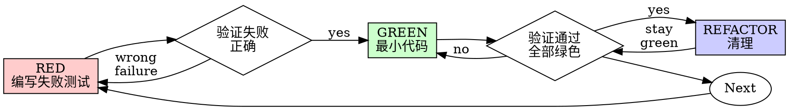

# 测试驱动开发 (Test-Driven Development, TDD)

## 概述

先写测试。看着它失败。编写最小代码通过。

**核心原则：** 如果你没有看到测试失败，你就不知道它测试的是正确的东西。

**违反规则的字面意思就是违反规则的精神。**

## 何时使用

**始终：**
- 新功能
- Bug 修复
- 重构
- 行为变更

**例外（询问您的人类伙伴）：**
- 临时原型
- 生成的代码
- 配置文件

想着"就这一次跳过 TDD"？停止。那是合理化。

## 铁律

```
没有失败测试在先就没有生产代码
```

在测试之前写代码？删除它。重新开始。

**没有例外：**
- 不要保留它作为"参考"
- 不要写测试时"调整"它
- 不要看它
- 删除意味着删除

从测试开始全新实现。就这样。

## 红-绿-重构 (Red-Green-Refactor)



### RED - 编写失败测试

编写一个最小测试显示应该发生什么。

<Good>
```typescript
test('retries failed operations 3 times', async () => {
  let attempts = 0;
  const operation = () => {
    attempts++;
    if (attempts < 3) throw new Error('fail');
    return 'success';
  };

  const result = await retryOperation(operation);

  expect(result).toBe('success');
  expect(attempts).toBe(3);
});
```
清晰的名称，测试真实行为，一件事
</Good>

<Bad>
```typescript
test('retry works', async () => {
  const mock = jest.fn()
    .mockRejectedValueOnce(new Error())
    .mockRejectedValueOnce(new Error())
    .mockResolvedValueOnce('success');
  await retryOperation(mock);
  expect(mock).toHaveBeenCalledTimes(3);
});
```
模糊的名称，测试 mock 而不是代码
</Bad>

**要求：**
- 一个行为
- 清晰的名称
- 真实代码（除非不可避免，否则不使用 mock）

### 验证 RED - 看着它失败

**强制。绝不跳过。**

```bash
npm test path/to/test.test.ts
```

确认：
- 测试失败（不是错误）
- 失败消息符合预期
- 因为功能缺失而失败（不是拼写错误）

**测试通过？** 你在测试现有行为。修复测试。

**测试错误？** 修复错误，重新运行直到正确失败。

### GREEN - 最小代码

编写最简单的代码通过测试。

<Good>
```typescript
async function retryOperation<T>(fn: () => Promise<T>): Promise<T> {
  for (let i = 0; i < 3; i++) {
    try {
      return await fn();
    } catch (e) {
      if (i === 2) throw e;
    }
  }
  throw new Error('unreachable');
}
```
刚好足够通过
</Good>

<Bad>
```typescript
async function retryOperation<T>(
  fn: () => Promise<T>,
  options?: {
    maxRetries?: number;
    backoff?: 'linear' | 'exponential';
    onRetry?: (attempt: number) => void;
  }
): Promise<T> {
  // YAGNI
}
```
过度工程
</Bad>

不要添加功能、重构其他代码或"改进"超出测试范围。

### 验证 GREEN - 看着它通过

**强制。**

```bash
npm test path/to/test.test.ts
```

确认：
- 测试通过
- 其他测试仍然通过
- 输出干净（无错误、警告）

**测试失败？** 修复代码，不是测试。

**其他测试失败？** 现在修复。

### REFACTOR - 清理

仅在绿色之后：
- 移除重复
- 改进名称
- 提取帮助函数

保持测试绿色。不要添加行为。

### 重复

下一个功能的下一个失败测试。

## 好的测试

| 质量 | 好 | 坏 |
|---------|------|-----|
| **最小化** | 一件事。名称中有"and"？拆分它。 | `test('validates email and domain and whitespace')` |
| **清晰** | 名称描述行为 | `test('test1')` |
| **显示意图** | 演示期望的 API | 混淆代码应该做什么 |

## 为什么顺序重要

**"我稍后写测试来验证它有效"**

之后编写的测试立即通过。立即通过证明不了什么：
- 可能测试了错误的东西
- 可能测试了实现，不是行为
- 可能错过了你忘记的边界情况
- 你从未看到它捕获 bug

测试优先迫使你看到测试失败，证明它确实测试了某些东西。

**"我已经手动测试了所有边界情况"**

手动测试是临时的。你以为你测试了一切，但是：
- 没有测试记录
- 代码变更时无法重新运行
- 压力下容易忘记情况
- "我试的时候有效" ≠ 全面的

自动化测试是系统化的。它们每次以相同方式运行。

**"删除 X 小时的工作是浪费的"**

沉没成本谬误。时间已经没了。你现在的选择：
- 删除并用 TDD 重写（再 X 小时，高置信度）
- 保留它并稍后添加测试（30 分钟，低置信度，可能有 bug）

"浪费"是你无法信任的代码。没有真实测试的工作代码是技术债务。

**"TDD 是教条的，务实意味着适应"**

TDD 就是务实的：
- 在提交前找到 bug（比之后调试更快）
- 防止回归（测试立即捕获破坏）
- 记录行为（测试显示如何使用代码）
- 启用重构（自由变更，测试捕获破坏）

"务实"捷径 = 生产环境调试 = 更慢。

**"之后测试实现相同目标 - 是精神而不是仪式"**

不。之后的测试回答"这个做什么？"测试优先回答"这个应该做什么？"

之后的测试被你的实现偏向。你测试你构建的，不是需要的。你验证记住的边界情况，不是发现的。

测试优先在实施前强制边界情况发现。之后测试验证你记住了所有（你没有）。

之后的 30 分钟测试 ≠ TDD。你有覆盖率，失去了测试有效的证明。

## 常见合理化

| 借口 | 现实 |
|--------|---------|
| "太简单不需要测试" | 简单代码也会坏。测试需要 30 秒。 |
| "我会稍后测试" | 测试立即通过证明不了什么。 |
| "之后测试实现相同目标" | 之后测试 = "这个做什么？"测试优先 = "这个应该做什么？" |
| "已经手动测试了" | 临时 ≠ 系统化。无记录，无法重新运行。 |
| "删除 X 小时是浪费的" | 沉没成本谬误。保留未验证代码是技术债务。 |
| "保留作为参考，先写测试" | 你会调整它。那是之后测试。删除意味着删除。 |
| "需要先探索" | 可以。扔掉探索，从 TDD 开始。 |
| "测试难 = 设计不清晰" | 听测试。难测试 = 难使用。 |
| "TDD 会拖慢我" | TDD 比调试快。务实 = 测试优先。 |
| "手动测试更快" | 手动不能证明边界情况。每次变更都要重新测试。 |
| "现有代码没有测试" | 你在改进它。为现有代码添加测试。 |

## 警告标志 - 停止并重新开始

- 代码在测试之前
- 实现之后测试
- 测试立即通过
- 无法解释为什么测试失败
- 测试"稍后"添加
- 合理化"就这一次"
- "我已经手动测试了它"
- "之后测试实现相同目的"
- "是精神而不是仪式"
- "保留作为参考"或"调整现有代码"
| "已经花了 X 小时，删除是浪费的" |
| "TDD 是教条的，我在务实" |
| "这不同因为..." |

**所有这些都意味着：删除代码。用 TDD 重新开始。**

## 示例：Bug 修复

**Bug：** 接受空 email

**RED**
```typescript
test('rejects empty email', async () => {
  const result = await submitForm({ email: '' });
  expect(result.error).toBe('Email required');
});
```

**验证 RED**
```bash
$ npm test
FAIL: expected 'Email required', got undefined
```

**GREEN**
```typescript
function submitForm(data: FormData) {
  if (!data.email?.trim()) {
    return { error: 'Email required' };
  }
  // ...
}
```

**验证 GREEN**
```bash
$ npm test
PASS
```

**REFACTOR**
如果需要为多个字段提取验证。

## 验证检查清单

在标记工作完成之前：

- [ ] 每个新函数/方法都有测试
- [ ] 在实施前看着每个测试失败
- [ ] 每个测试因预期原因失败（功能缺失，不是拼写错误）
- [ ] 编写最小代码通过每个测试
- [ ] 所有测试通过
- [ ] 输出干净（无错误、警告）
- [ ] 测试使用真实代码（仅当不可避免时使用 mock）
- [ ] 覆盖边界情况和错误

无法勾选所有？你跳过了 TDD。重新开始。

## 卡住时

| 问题 | 解决方案 |
|---------|----------|
| 不知道如何测试 | 编写期望的 API。先写断言。询问您的人类伙伴。 |
| 测试太复杂 | 设计太复杂。简化接口。 |
| 必须 mock 一切 | 代码太耦合。使用依赖注入。 |
| 测试设置庞大 | 提取帮助函数。仍然复杂？简化设计。 |

## 调试集成

找到 bug？编写失败测试重现它。遵循 TDD 循环。测试证明修复并防止回归。

绝不修复没有测试的 bug。

## 测试反模式

添加 mock 或测试工具时，阅读 @testing-anti-patterns.md 以避免常见陷阱：
- 测试 mock 行为而不是真实行为
- 向生产类添加仅测试方法
- 在不理解依赖的情况下 mock

## 最终规则

```
生产代码 → 测试存在并且先失败
否则 → 不是 TDD
```

未经您的人类伙伴许可，没有例外。
