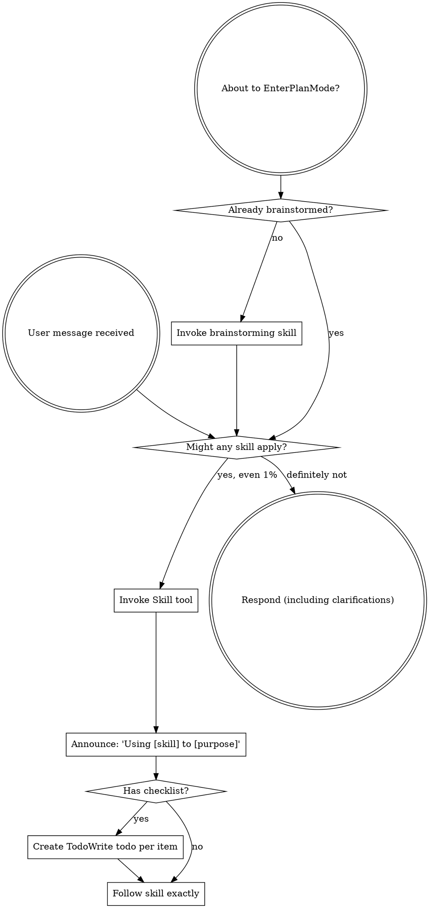

<EXTREMELY-IMPORTANT>
如果你认为有哪怕 1% 的机会某个 skill 可能适用于你正在做的事情，你**绝对必须**调用该 skill。

如果某个 skill 适用于你的任务，你没有选择。你必须使用它。

这是不可协商的。这不是可选的。你无法通过合理化来逃避这一点。
</EXTREMELY-IMPORTANT>

## 如何访问 Skills

**在 Claude Code 中：** 使用 `Skill` 工具。当你调用 skill 时，其内容会被加载并呈现给你——直接遵循它。永远不要使用 Read 工具读取 skill 文件。

**在其他环境中：** 查看你平台的文档了解如何加载 skills。

# 使用 Skills

## 规则

**在任何响应或行动之前调用相关或请求的 skills。** 即使只有 1% 的机会某个 skill 可能适用，你也应该调用 skill 检查。如果调用的 skill 被证明不适合该情况，你不需要使用它。

## 危险信号

这些想法意味着 STOP——你在合理化：

| 想法 | 现实 |
|---------|--------|
| "这只是个简单的问题" | 问题是任务。检查 skills。 |
| "我需要先更多上下文" | Skill 检查在澄清问题之前。 |
| "让我先探索代码库" | Skills 告诉你如何探索。先检查。 |
| "我可以快速检查 git/文件" | 文件缺乏对话上下文。检查 skills。 |
| "让我先收集信息" | Skills 告诉你如何收集信息。 |
| "这不需要正式 skill" | 如果 skill 存在，使用它。 |
| "我记得这个 skill" | Skills 演进。阅读当前版本。 |
| "这不算任务" | 行动 = 任务。检查 skills。 |
| "Skill 是小题大做" | 简单的事变得复杂。使用它。 |
| "我先做这个" | 在做任何事之前检查。 |
| "这感觉有成效" | 无纪律的行动浪费时间。Skills 防止这个。 |
| "我知道那是什么意思" | 知道概念 ≠ 使用 skill。调用它。 |

## Skill 优先级

当多个 skills 可能适用时，使用此顺序：

1. **过程 skills 优先** (brainstorming, debugging) - 这些决定如何接近任务
2. **实施 skills 其次** (frontend-design, mcp-builder) - 这些指导执行

"Let's build X" → brainstorming 优先，然后是 implementation skills。
"Fix this bug" → debugging 优先，然后是 domain-specific skills。

## Skill 类型

**严格** (TDD, debugging)：严格遵循。不要偏离纪律。

**灵活** (patterns)：根据上下文调整原则。

Skill 本身告诉你哪个。

## 用户指令

指令说 WHAT，不是 HOW。"Add X" 或 "Fix Y" 不意味着跳过工作流。
