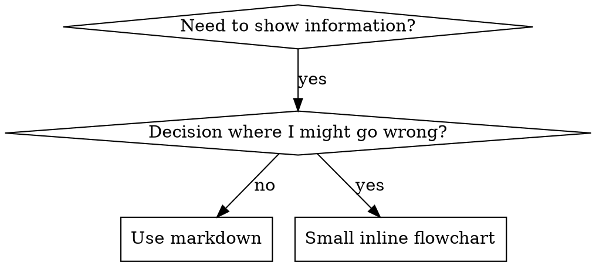

# 编写 Skills (Writing Skills)

## 概述

**编写 skills 是将测试驱动开发应用于过程文档。**

**个人 skills 存在于 agent 特定的目录中（`~/.claude/skills` 用于 Claude Code，`~/.agents/skills/` 用于 Codex）**

你编写测试用例（带有 subagents 的压力场景），看着它们失败（基线行为），编写 skill（文档），看着测试通过（agents 遵守），然后重构（堵住漏洞）。

**核心原则：** 如果你没有看到 agent 在没有 skill 的情况下失败，你就不知道 skill 是否教对了东西。

**必需背景：** 在使用此 skill 之前，你必须理解 superpowers:test-driven-development。该 skill 定义了基本的 RED-GREEN-REFACTOR 循环。此 skill 将 TDD 应用于文档。

**官方指导：** 对于 Anthropic 的官方 skill 编写最佳实践，请参阅 anthropic-best-practices.md。本文档提供了补充此 skill 中 TDD 聚焦方法的额外模式和指南。

## 什么是 Skill？

**skill** 是已证明技术、模式或工具的参考指南。Skills 帮助未来的 Claude 实例找到并应用有效的方法。

**Skills 是：** 可重用的技术、模式、工具、参考指南

**Skills 不是：** 关于你如何一次性解决问题的叙述

## Skills 的 TDD 映射

| TDD 概念 | Skill 创建 |
|-------------|----------------|
| **测试用例** | 带有 subagent 的压力场景 |
| **生产代码** | Skill 文档 (SKILL.md) |
| **测试失败 (RED)** | 没有 skill 时 agent 违反规则（基线） |
| **测试通过 (GREEN)** | 有 skill 时 agent 遵守 |
| **重构** | 在保持遵守的同时堵住漏洞 |
| **先写测试** | 在编写 skill 之前运行基线场景 |
| **看着它失败** | 记录 agent 使用的确切合理化 |
| **最小代码** | 编写 skill 解决那些特定违规 |
| **看着它通过** | 验证 agent 现在遵守 |
| **重构循环** | 找到新的合理化 → 堵住 → 重新验证 |

整个 skill 创建过程遵循 RED-GREEN-REFACTOR。

## 何时创建 Skill

**在以下情况创建：**
- 技术对你来说不是直观明显的
- 你会跨项目引用这个
- 模式广泛适用（不是项目特定的）
- 其他人会受益

**不要为以下情况创建：**
- 一次性解决方案
- 其他地方有充分文档记录的标准实践
- 项目特定的约定（放在 CLAUDE.md 中）
- 机械约束（如果可以用正则/验证强制执行，就自动化它——将文档留给判断调用）

## Skill 类型

### 技术 (Technique)
带有步骤遵循的具体方法（condition-based-waiting, root-cause-tracing）

### 模式 (Pattern)
思考问题的方式（flatten-with-flags, test-invariants）

### 参考 (Reference)
API 文档、语法指南、工具文档（office docs）

## 目录结构


```
skills/
  skill-name/
    SKILL.md              # 主要参考（必需）
    supporting-file.*     # 仅在需要时
```

**扁平命名空间** - 所有 skills 在一个可搜索的命名空间中

**单独文件用于：**
1. **重量级参考** (100+ 行) - API 文档、综合语法
2. **可重用工具** - 脚本、工具、模板

**保持内联：**
- 原则和概念
- 代码模式 (< 50 行)
- 其他所有内容

## SKILL.md 结构

**Frontmatter (YAML)：**
- 仅支持两个字段：`name` 和 `description`
- 总计最多 1024 字符
- `name`: 仅使用字母、数字和连字符（无括号、特殊字符）
- `description`: 第三人称，仅描述何时使用（不是做什么）
  - 以 "Use when..." 开头以聚焦于触发条件
  - 包括具体症状、情况和上下文
  - **绝不总结 skill 的过程或工作流**（参见 CSO 部分了解原因）
  - 尽可能保持在 500 字符以下

```markdown
---
name: Skill-Name-With-Hyphens
description: Use when [specific triggering conditions and symptoms]
---

# Skill Name

## Overview
这是什么？1-2 句话的核心原则。

## When to Use
[如果决策不明显，小内联流程图]

带有症状和用例的项目符号列表
何时不使用

## Core Pattern（用于技术/模式）
Before/after 代码对比

## Quick Reference
用于扫描常见操作的表格或项目符号

## Implementation
简单模式内联代码
重量级参考或可重用工具链接到文件

## Common Mistakes
出错的地方 + 修复

## Real-World Impact（可选）
具体结果
```


## Claude 搜索优化 (Claude Search Optimization, CSO)

**对发现至关重要：** 未来的 Claude 需要找到你的 skill

### 1. 丰富的描述字段

**目的：** Claude 阅读描述以决定为给定任务加载哪些 skills。让它回答："我现在应该阅读这个 skill 吗？"

**格式：** 以 "Use when..." 开头以聚焦于触发条件

**关键：描述 = 何时使用，不是 Skill 做什么**

描述应该仅描述触发条件。不要在描述中总结 skill 的过程或工作流。

**为什么这很重要：** 测试表明，当描述总结 skill 的工作流时，Claude 可能会遵循描述而不是阅读完整的 skill 内容。一个说"code review between tasks"的描述导致 Claude 只做一次审查，即使 skill 的流程图清楚地显示了两个审查（规范合规性然后代码质量）。

当描述改为仅"Use when executing implementation plans with independent tasks"（无工作流总结）时，Claude 正确地阅读了流程图并遵循了两阶段审查过程。

**陷阱：** 总结工作流的描述创建了 Claude 会采取的捷径。Skill 正文成为 Claude 跳过的文档。

```yaml
# ❌ BAD: 总结工作流 - Claude 可能遵循这个而不是阅读 skill
description: Use when executing plans - dispatches subagent per task with code review between tasks

# ❌ BAD: 太多过程细节
description: Use for TDD - write test first, watch it fail, write minimal code, refactor

# ✅ GOOD: 仅触发条件，无工作流总结
description: Use when executing implementation plans with independent tasks in the current session

# ✅ GOOD: 仅触发条件
description: Use when implementing any feature or bugfix, before writing implementation code
```

**内容：**
- 使用表明此 skill 适用的具体触发器、症状和情况
- 描述 *问题*（竞态条件、不一致行为）不是 *语言特定症状*（setTimeout, sleep）
- 除非 skill 本身是技术特定的，否则保持触发器与语言无关
- 如果 skill 是技术特定的，在触发器中明确说明
- 用第三人称编写（注入系统提示）
- **绝不总结 skill 的过程或工作流**

```yaml
# ❌ BAD: 太抽象、模糊，不包括何时使用
description: For async testing

# ❌ BAD: 第一人称
description: I can help you with async tests when they're flaky

# ❌ BAD: 提到技术但 skill 不特定于它
description: Use when tests use setTimeout/sleep and are flaky

# ✅ GOOD: 以 "Use when" 开头，描述问题，无工作流
description: Use when tests have race conditions, timing dependencies, or pass/fail inconsistently

# ✅ GOOD: 带有明确触发器的技术特定 skill
description: Use when using React Router and handling authentication redirects
```

### 2. 关键词覆盖

使用 Claude 会搜索的词：
- 错误消息："Hook timed out", "ENOTEMPTY", "race condition"
- 症状："flaky", "hanging", "zombie", "pollution"
- 同义词："timeout/hang/freeze", "cleanup/teardown/afterEach"
- 工具：实际命令、库名称、文件类型

### 3. 描述性命名

**使用主动语态，动词优先：**
- ✅ `creating-skills` 不是 `skill-creation`
- ✅ `condition-based-waiting` 不是 `async-test-helpers`

### 4. Token 效率（关键）

**问题：** getting-started 和频繁引用的 skills 加载到每个对话中。每个 token 都重要。

**目标字数：**
- getting-started 工作流：每个 <150 词
- 频繁加载的 skills：总计 <200 词
- 其他 skills：<500 词（仍然简洁）

**技术：**

**将细节移动到工具帮助：**
```bash
# ❌ BAD: 在 SKILL.md 中记录所有标志
search-conversations supports --text, --both, --after DATE, --before DATE, --limit N

# ✅ GOOD: 引用 --help
search-conversations supports multiple modes and filters. Run --help for details.
```

**使用交叉引用：**
```markdown
# ❌ BAD: 重复工作流细节
When searching, dispatch subagent with template...
[20 lines of repeated instructions]

# ✅ GOOD: 引用其他 skill
Always use subagents (50-100x context savings). REQUIRED: Use [other-skill-name] for workflow.
```

**压缩示例：**
```markdown
# ❌ BAD: 冗长示例（42 词）
your human partner: "How did we handle authentication errors in React Router before?"
You: I'll search past conversations for React Router authentication patterns.
[Dispatch subagent with search query: "React Router authentication error handling 401"]

# ✅ GOOD: 最小示例（20 词）
Partner: "How did we handle auth errors in React Router?"
You: Searching...
[Dispatch subagent → synthesis]
```

**消除冗余：**
- 不要重复交叉引用 skills 中的内容
- 不要解释从命令中显而易见的内容
- 不要包括同一模式的多个示例

**验证：**
```bash
wc -w skills/path/SKILL.md
# getting-started 工作流：目标 <150 每个
# 其他频繁加载的：目标 <200 总计
```

**按你做什么或核心见解命名：**
- ✅ `condition-based-waiting` > `async-test-helpers`
- ✅ `using-skills` 不是 `skill-usage`
- ✅ `flatten-with-flags` > `data-structure-refactoring`
- ✅ `root-cause-tracing` > `debugging-techniques`

**动名词 (-ing) 对过程很有效：**
- `creating-skills`, `testing-skills`, `debugging-with-logs`
- 主动的，描述你正在采取的行动

### 4. 交叉引用其他 Skills

**编写引用其他 skills 的文档时：**

仅使用 skill 名称，带有明确要求标记：
- ✅ Good: `**REQUIRED SUB-SKILL:** Use superpowers:test-driven-development`
- ✅ Good: `**REQUIRED BACKGROUND:** You MUST understand superpowers:systematic-debugging`
- ❌ Bad: `See skills/testing/test-driven-development`（不清楚是否必需）
- ❌ Bad: `@skills/testing/test-driven-development/SKILL.md`（强制加载，消耗上下文）

**为什么不用 @ 链接：** `@` 语法立即强制加载文件，在需要之前消耗 200k+ 上下文。

## 流程图使用



**仅对以下情况使用流程图：**
- 不明显的决策点
- 你可能过早停止的过程循环
- "何时使用 A vs B" 决策

**绝不对以下情况使用流程图：**
- 参考材料 → 表格、列表
- 代码示例 → Markdown 块
- 线性指令 → 编号列表
- 没有语义含义的标签（step1, helper2）

请参阅 @graphviz-conventions.dot 了解 graphviz 样式规则。

**为您的人类伙伴可视化：** 使用此目录中的 `render-graphs.js` 将 skill 的流程图渲染为 SVG：
```bash
./render-graphs.js ../some-skill           # 每个图表单独
./render-graphs.js ../some-skill --combine # 所有图表在一个 SVG 中
```

## 代码示例

**一个优秀的示例胜过许多平庸的示例**

选择最相关的语言：
- 测试技术 → TypeScript/JavaScript
- 系统调试 → Shell/Python
- 数据处理 → Python

**好的示例：**
- 完整且可运行
- 解释 WHY 的注释良好
- 来自真实场景
- 清楚地显示模式
- 准备好适应（不是通用模板）

**不要：**
- 用 5+ 种语言实现
- 创建填空模板
- 编写人为的示例

你擅长移植——一个伟大的示例就足够了。

## 文件组织

### 自包含 Skill
```
defense-in-depth/
  SKILL.md    # 一切内联
```
何时：所有内容适合，不需要重量级参考

### 带有可重用工具的 Skill
```
condition-based-waiting/
  SKILL.md    # 概述 + 模式
  example.ts  # 可适应的工作帮助函数
```
何时：工具是可重用代码，不只是叙述

### 带有重量级参考的 Skill
```
pptx/
  SKILL.md       # 概述 + 工作流
  pptxgenjs.md   # 600 行 API 参考
  ooxml.md       # 500 行 XML 结构
  scripts/       # 可执行工具
```
何时：参考材料太大无法内联

## 铁律（与 TDD 相同）

```
没有失败测试在先就没有 SKILL
```

这适用于新 skills 和现有 skills 的编辑。

在测试之前写 skill？删除它。重新开始。
没有测试就编辑 skill？同样的违规。

**没有例外：**
- 不是用于"简单添加"
- 不是用于"只是添加一个部分"
- 不是用于"文档更新"
- 不要将未经测试的变更保留为"参考"
- 不要在运行测试时"调整"
- 删除意味着删除

**必需背景：** superpowers:test-driven-development skill 解释了为什么这很重要。相同原则适用于文档。

## 测试所有 Skill 类型

不同类型的 skills 需要不同的测试方法：

### 强制执行纪律的 Skills（规则/要求）

**示例：** TDD, verification-before-completion, designing-before-coding

**用以下测试：**
- 学术问题：他们理解规则吗？
- 压力场景：他们在压力下遵守吗？
- 多种压力组合：时间 + 沉没成本 + 疲惫
- 识别合理化并添加明确反驳

**成功标准：** Agent 在最大压力下遵循规则

### 技术 Skills（操作指南）

**示例：** condition-based-waiting, root-cause-tracing, defensive-programming

**用以下测试：**
- 应用场景：他们能正确应用技术吗？
- 变体场景：他们处理边界情况吗？
- 缺失信息测试：指令有差距吗？

**成功标准：** Agent 成功将技术应用于新场景

### 模式 Skills（心智模型）

**示例：** reducing-complexity, information-hiding 概念

**用以下测试：**
- 识别场景：他们识别模式何时适用吗？
- 应用场景：他们能使用心智模型吗？
- 反例：他们知道何时不应用吗？

**成功标准：** Agent 正确识别何时/如何应用模式

### 参考 Skills（文档/API）

**示例：** API 文档、命令参考、库指南

**用以下测试：**
- 检索场景：他们能找到正确的信息吗？
- 应用场景：他们能正确使用找到的内容吗？
- 差距测试：常见用例被覆盖了吗？

**成功标准：** Agent 找到并正确应用参考信息

## 跳过测试的常见合理化

| 借口 | 现实 |
|--------|---------|
| "Skill 显然很清晰" | 对你清晰 ≠ 对其他 agents 清晰。测试它。 |
| "这只是个参考" | 参考可能有差距、不清晰的章节。测试检索。 |
| "测试是小题大做" | 未经测试的 skills 有问题。总是。15 分钟测试节省数小时。 |
| "如果出现问题我会测试" | 问题 = agents 无法使用 skill。在部署前测试。 |
| "测试太繁琐" | 测试比调试生产环境中的坏 skill 更不繁琐。 |
| "我有信心它很好" | 过度自信保证问题。无论如何测试。 |
| "学术审查足够" | 阅读 ≠ 使用。测试应用场景。 |
| "没有时间测试" | 部署未经测试的 skill 浪费更多时间稍后修复它。 |

**所有这些都意味着：部署前测试。没有例外。**

## 针对合理化的加固 Skills

强制执行纪律的 skills（如 TDD）需要抵抗合理化。Agents 很聪明，会在压力下找到漏洞。

**心理学说明：** 理解说服技术为什么有效帮助你系统地应用它们。请参阅 persuasion-principles.md 了解研究基础（Cialdini, 2021; Meincke et al., 2025）关于权威、承诺、稀缺、社会认同和团结原则。

### 明确堵住每个漏洞

不要只陈述规则 - 禁止特定变通办法：

<Bad>
```markdown
在测试之前写代码？删除它。
```
</Bad>

<Good>
```markdown
在测试之前写代码？删除它。重新开始。

**没有例外：**
- 不要保留它作为"参考"
- 不要在写测试时"调整"它
- 不要看它
- 删除意味着删除
```
</Good>

### 解决"精神 vs 字面"论点

尽早添加基础原则：

```markdown
**违反规则的字面意思就是违反规则的精神。**
```

这切断了一整类"我遵循精神"的合理化。

### 构建合理化表格

从基线测试中捕获合理化（见下面的测试部分）。Agents 做出的每个借口都进入表格：

```markdown
| 借口 | 现实 |
|--------|---------|
| "太简单不需要测试" | 简单代码也会坏。测试需要 30 秒。 |
| "我会稍后测试" | 测试立即通过证明不了什么。 |
| "之后测试实现相同目标" | 之后测试 = "这个做什么？" 测试优先 = "这个应该做什么？" |
```

### 创建警告标志列表

让 agents 在合理化时容易自我检查：

```markdown
## 警告标志 - 停止并重新开始

- 代码在测试之前
- "我已经手动测试了它"
- "之后测试实现相同目的"
- "是精神而不是仪式"
- "这不同因为..."

**所有这些都意味着：删除代码。用 TDD 重新开始。**
```

### 为违规症状更新 CSO

添加到描述：当你即将违反规则时的症状：

```yaml
description: use when implementing any feature or bugfix, before writing implementation code
```

## Skills 的 RED-GREEN-REFACTOR

遵循 TDD 循环：

### RED：编写失败测试（基线）

运行带有 subagent 的压力场景而不使用 skill。记录确切行为：
- 他们做了什么选择？
- 他们使用了什么合理化（逐字）？
- 哪些压力触发了违规？

这是"看着测试失败"——你必须在编写 skill 之前看到 agents 自然做什么。

### GREEN：编写最小 Skill

编写 skill 解决那些特定的合理化。不要为假设的情况添加额外内容。

用 skill 运行相同的场景。Agent 现在应该遵守。

### REFACTOR：堵住漏洞

Agent 找到新的合理化？添加明确的反驳。重新测试直到加固。

**测试方法：** 请参阅 @testing-skills-with-subagents.md 了解完整的测试方法：
- 如何编写压力场景
- 压力类型（时间、沉没成本、权威、疲惫）
- 系统地堵住漏洞
- 元测试技术

## 反模式

### ❌ 叙述示例
"在 2025-10-03 会话中，我们发现空的 projectDir 导致..."
**为什么坏：** 太具体，不可重用

### ❌ 多语言稀释
example-js.js, example-py.py, example-go.go
**为什么坏：** 平庸质量，维护负担

### ❌ 流程图中的代码
```dot
step1 [label="import fs"];
step2 [label="read file"];
```
**为什么坏：** 无法复制粘贴，难以阅读

### ❌ 通用标签
helper1, helper2, step3, pattern4
**为什么坏：** 标签应该有语义含义

## 停止：在移动到下一个 Skill 之前

**编写任何 skill 后，你必须停止并完成部署过程。**

**不要：**
- 批量创建多个 skills 而不测试每个
- 在当前 skill 验证之前移动到下一个
- 跳过测试因为"批量更高效"

**下面的部署检查清单对每个 skill 都是强制性的。**

部署未经测试的 skills = 部署未经测试的代码。这是质量标准的违规。

## Skill 创建检查清单（TDD 适配）

**重要：使用 TodoWrite 为下面的每个检查清单项创建 todos。**

**RED 阶段 - 编写失败测试：**
- [ ] 创建压力场景（3+ 种组合压力用于纪律 skills）
- [ ] 不使用 skill 运行场景 - 逐字记录基线行为
- [ ] 识别合理化/失败中的模式

**GREEN 阶段 - 编写最小 Skill：**
- [ ] 名称仅使用字母、数字、连字符（无括号/特殊字符）
- [ ] 带有 name 和 description 的 YAML frontmatter（最多 1024 字符）
- [ ] Description 以 "Use when..." 开头并包括特定触发器/症状
- [ ] Description 用第三人称编写
- [ ] 全文关键词用于搜索（错误、症状、工具）
- [ ] 清晰的概述带核心原则
- [ ] 解决 RED 中识别的特定基线失败
- [ ] 代码内联或链接到单独文件
- [ ] 一个优秀的示例（不是多语言）
- [ ] 用 skill 运行场景 - 验证 agents 现在遵守

**REFACTOR 阶段 - 堵住漏洞：**
- [ ] 从测试中识别新的合理化
- [ ] 添加明确反驳（如果是纪律 skill）
- [ ] 从所有测试迭代构建合理化表格
- [ ] 创建警告标志列表
- [ ] 重新测试直到加固

**质量检查：**
- [ ] 仅当决策不明显时小流程图
- [ ] 快速参考表
- [ ] 常见错误部分
- [ ] 无叙述讲故事
- [ ] 仅用于工具或重量级参考的支持文件

**部署：**
- [ ] 将 skill 提交到 git 并推送到你的 fork（如果已配置）
- [ ] 考虑通过 PR 贡献回来（如果广泛有用）

## 发现工作流

未来 Claude 如何找到你的 skill：

1. **遇到问题** ("tests are flaky")
3. **找到 SKILL**（描述匹配）
4. **扫描概述**（这相关吗？）
5. **阅读模式**（快速参考表）
6. **加载示例**（仅在实施时）

**为此流程优化** - 尽早并经常放置可搜索的术语。

## 底线

**创建 skills 是过程文档的 TDD。**

相同的铁律：没有失败测试在先就没有 skill。
相同的循环：RED（基线）→ GREEN（编写 skill）→ REFACTOR（堵住漏洞）。
相同的好处：更好的质量、更少的意外、加固的结果。

如果你遵循代码的 TDD，就遵循 skills 的 TDD。这是应用于文档的相同纪律。
